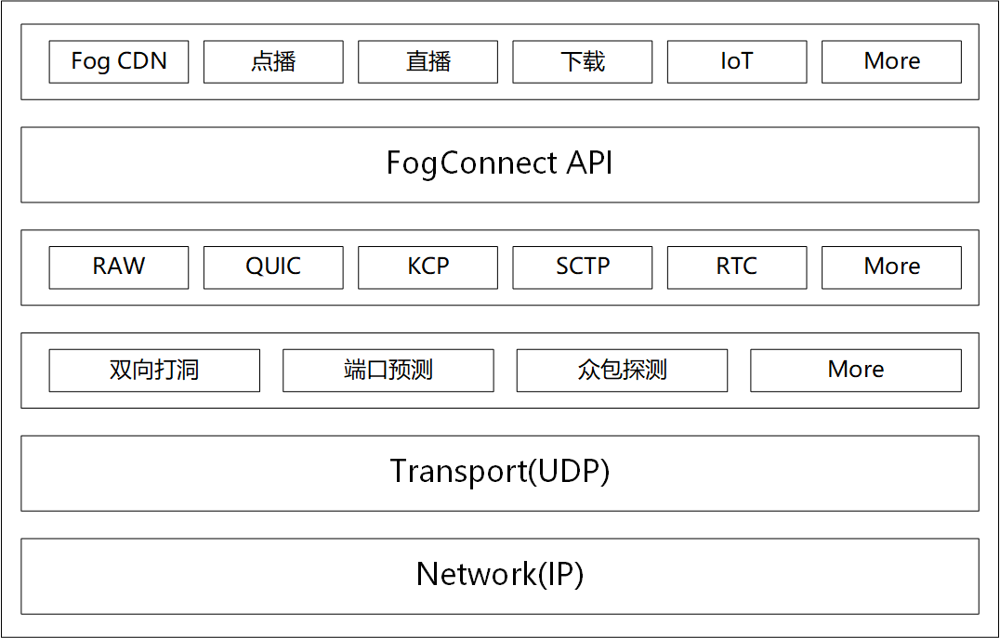
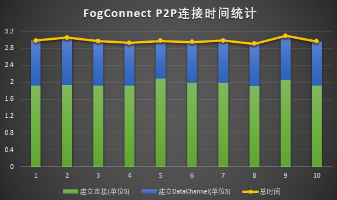

## 雾连接传输组件（FogConnet）

FogConnet 是用于P2P网络中连接，调度，传输等功能于一体的组件。

### 架构图


### 特性
1. 支持多种传输控制协议(QUIC,RTC,KCP,uTP,SCTP等等)。
2. 探测NAT类型，并收集和维护用于P2P连接的IP：PORT列表。
3. 支持双向“打洞”和高级端口预测。
4. NAT类型最优匹配组合策略。
5. 连接控制与物理距离最近原则。
6. UDP协议作为传输层。
7. 支持多种传输控制协议(QUIC, RTC, KCP, uTP, SCTP等等)。
8. 具有中继功能。
9. 所有网络信号采用事件机制处理。
10. 对资源消耗极少（一般运行状态下内存占用3～5M,峰值不超过50M）。
11. API简单，易懂，支持多种方式接入。

## 快速开始
- 阅读[编译步骤](doc/getting_started.md)了解如何开始使用, 之后可以运行一下[示例程序](examples).

## 性能测试


## Examples

### server
```C
#include <stdio.h>
#include <sys/socket.h>
#include <netinet/in.h>
#include <glib.h>
#include "fogconnect.h"

struct pr_usr_data 
{
    void* pr_data;
};

void pr_recv_data(void* pr_connect, void* cbarg, void* buf, int size) 
{
    int l_size;
    char* data = "I am fog data!";
    (cbarg);

    if (buf && size)
    {
        if (strlen(data) == size && !memcmp(buf, data, size)) 
        {
            printf("size:%d , mgs:%s!\n", size, buf);
            l_size = pr_send_peer(pr_connect, "I know!", strlen("I know!"));
        }
        else
        {
            printf("size:%d , mgs:%s!\n", size, buf);
        }
    }
    return;
}

void  pr_close_connect(void* connect, void* cbarg)
{
    g_free(cbarg);
    return;
}

#define  pr_recv_data_1 pr_recv_data
#define  pr_close_connect_1 pr_close_connect

void pr_set_third_callback(void* pr_connect)
{
/*
   convention_n 各个位的定义。可以看出定义了的分部都是由pr_connect_peer函数的相关参数（int protocol, int connect_server）来确定。
   31    23    15    7     0
// |-----|-----|-----|-----|
                  |     |-------------->低4位（0～3）表示双方约定的传输协议。
                     |-------->8位(4~11)表示应用层自定定义的约定。
   |----------->(12~31)未定义。
*/
    uint32_t convention_n = pr_get_convention_number(pr_connect);
    switch(((convention_n & 0xff0) >> 4))
    {
        case 0:
            pr_event_setcb(pr_connect, pr_recv_data, pr_close_connect);
            break;
        //以下为示例，根据应用需要来决定。
        case 1:
            pr_event_setcb(pr_connect, pr_recv_data_1, pr_close_connect_1);
            break;
        case 2:
            //pr_event_setcb(pr_connect, pr_recv_data_2, pr_close_connect_2);
            break;
        default:
            //pr_event_setcb(pr_connect, pr_recv_data_default, pr_close_connect_default);
            break;
    }
}

void pr_connect_callback(void* pr_connect, short events, void* cbarg)
{
    struct pr_usr_data* arg = (cbarg);
    switch (events)
    {
        case PR_EVENT_CONNECTED:
            printf("set  callback!\n");
            if (arg) arg->pr_data = pr_connect;
            else if (pr_connect_is_passive(pr_connect))
            {
                //表示当前雾节点，被其它雾节点发起了链接，当前雾节点为被动方。
                struct pr_usr_data* cbarg_data = g_malloc0(sizeof(struct pr_usr_data));
                pr_connect_set_userdata(pr_connect, cbarg_data);
                //保存链接信息以便其它过程使用。
                cbarg_data->pr_data = pr_connect;
            }
            //设置回调，以便应用读取雾节点数据。
            pr_set_third_callback(pr_connect);
            break;
        case PR_EVENT_EOF:
        case PR_EVENT_ERROR:
        case PR_EVENT_TIMEOUT:
            printf("connect fail!\n");
            printf("mgs:%s!\n" , pr_errno_mgs(pr_connect));
            g_free(cbarg);
            break;
        default:
            break;
    }
    return;
}

void pr_set_signal_info(struct pr_signal_server* signal_info)
{
    if (signal_info == NULL) exit(0);
    signal_info->url  = "47.52.153.245";
    signal_info->type = "/ws";
    signal_info->certificate = NULL;
    signal_info->privatekey  = NULL;
    signal_info->port = 7600;
}

int main(int argc, char *argv[])
{
    int count = 100;

    //初始化fogconnect组件。
    void* ctx = pr_fogconnect_init();
    if (!ctx) return 0;

    //测试时，设置的ID，这么为MAC地址。
    set_id("ee:34:a1:44:2c:1c");

    //设置被动时的回调函数。
    pr_fogconnect_set_callback(ctx, pr_connect_callback);
    printf("ctx = %p\n", ctx);

    //以下以连接信令服务器的操作。
    struct pr_signal_server* signal_info = g_malloc0(sizeof(struct pr_signal_server));
    signal_info->ctx  = ctx;
    pr_set_signal_info(signal_info);
    pr_init_signal(signal_info);

    while (count--) g_usleep(2000000);
    pr_fogconnect_release(ctx);
    return 0;
}

```
### Client

```C
#include <stdio.h>
#include <sys/socket.h>
#include <netinet/in.h>
#include <glib.h>
#include "fogconnect.h"


struct pr_usr_data 
{
    void* pr_data;
};

void pr_recv_data(void* pr_connect, void* cbarg, void* buf, int size) 
{
    int l_size;
    char* data = "I am fog data!";
    (cbarg);

    if (buf && size)
    {
        if (strlen(data) == size && !memcmp(buf, data, size)) 
        {
            printf("size:%d , mgs:%s!\n", size, buf);
            l_size = pr_send_peer(pr_connect, "I know!", strlen("I know!"));
        }
        else
        {
            printf("size:%d , mgs:%s!\n", size, buf);
        }
    }
    return;
}

void  pr_close_connect(void* connect, void* cbarg)
{
    g_free(cbarg);
    return;
}

#define  pr_recv_data_1 pr_recv_data
#define  pr_close_connect_1 pr_close_connect

void pr_set_third_callback(void* pr_connect)
{
/*
   convention_n 各个位的定义。可以看出定义了的分部都是由pr_connect_peer函数的相关参数（int protocol, int connect_server）来确定。
   31    23    15    7     0
// |-----|-----|-----|-----|
                  |     |-------------->低4位（0～3）表示双方约定的传输协议。
                     |-------->8位(4~11)表示应用层自定定义的约定。
   |----------->(12~31)未定义。
*/
    uint32_t convention_n = pr_get_convention_number(pr_connect);
    switch(((convention_n & 0xff0) >> 4))
    {
        case 0:
            pr_event_setcb(pr_connect, pr_recv_data, pr_close_connect);
            break;
        //以下为示例，根据应用需要来决定。
        case 1:
            pr_event_setcb(pr_connect, pr_recv_data_1, pr_close_connect_1);
            pr_send_peer(pr_connect, "I am fog data!", strlen("I am fog data!"));
            break;
        case 2:
            //pr_event_setcb(pr_connect, pr_recv_data_2, pr_close_connect_2);
            break;
        default:
            //pr_event_setcb(pr_connect, pr_recv_data_default, pr_close_connect_default);
            break;
    }
}

void pr_connect_callback(void* pr_connect, short events, void* cbarg)
{
    struct pr_usr_data* arg = (cbarg);
    switch (events)
    {
        case PR_EVENT_CONNECTED:
            printf("set  callback!\n");
            if (arg) arg->pr_data = pr_connect;
            else if (pr_connect_is_passive(pr_connect))
            {
                //表示当前雾节点，被其它雾节点发起了链接，当前雾节点为被动方。
                struct pr_usr_data* cbarg_data = g_malloc0(sizeof(struct pr_usr_data));
                pr_connect_set_userdata(pr_connect, cbarg_data);
                //保存链接信息以便其它过程使用。
                cbarg_data->pr_data = pr_connect;
            }
            //设置回调，以便应用读取雾节点数据。
            pr_set_third_callback(pr_connect);
            break;
        case PR_EVENT_EOF:
        case PR_EVENT_ERROR:
        case PR_EVENT_TIMEOUT:
            printf("connect fail!\n");
            printf("mgs:%s!\n" , pr_errno_mgs(pr_connect));
            g_free(cbarg);
            break;
        default:
            break;
    }
    return;
}

void pr_set_signal_info(struct pr_signal_server* signal_info)
{
    if (signal_info == NULL) exit(0);
    signal_info->url  = "47.52.153.245";
    signal_info->type = "/ws";
    signal_info->certificate = NULL;
    signal_info->privatekey  = NULL;
    signal_info->port = 7600;
}

int main(int argc, char *argv[])
{
    int count = 100;

    //初始化fogconnect组件。
    void* ctx = pr_fogconnect_init();
    if (!ctx) return 0;

    //测试时，设置的ID，这么为MAC地址。
    set_id("ee:34:a1:44:1c:1c");

    //设置被动时的回调函数。
    pr_fogconnect_set_callback(ctx, pr_connect_callback);
    printf("ctx = %p\n", ctx);

    //以下以连接信令服务器的操作。
    struct pr_signal_server* signal_info = g_malloc0(sizeof(struct pr_signal_server));
    signal_info->ctx  = ctx;
    pr_set_signal_info(signal_info);
    pr_init_signal(signal_info);

    //以下为主动对雾节点发起的链接。
    {
        //quic protocol
    void* cbarg_udp = g_malloc0(sizeof(struct pr_usr_data));
    int pr_udp = pr_connect_peer(ctx, "ee:34:a1:44:2c:1c",
                               PR_TRANSPORT_PROTOCOL_QUIC, 
                               1, //注意这个参数，与服务的选择相关联。请看pr_set_third_callback函数的处理。
                               pr_connect_callback, cbarg_udp);
    }
    while (count--) g_usleep(2000000);
    pr_fogconnect_release(ctx);
    return 0;
}
```

## 文档
- [FogConnet协议栈](https://km.webrtc.win/index.php?share/file&user=102&sid=hmXV7SpC)


